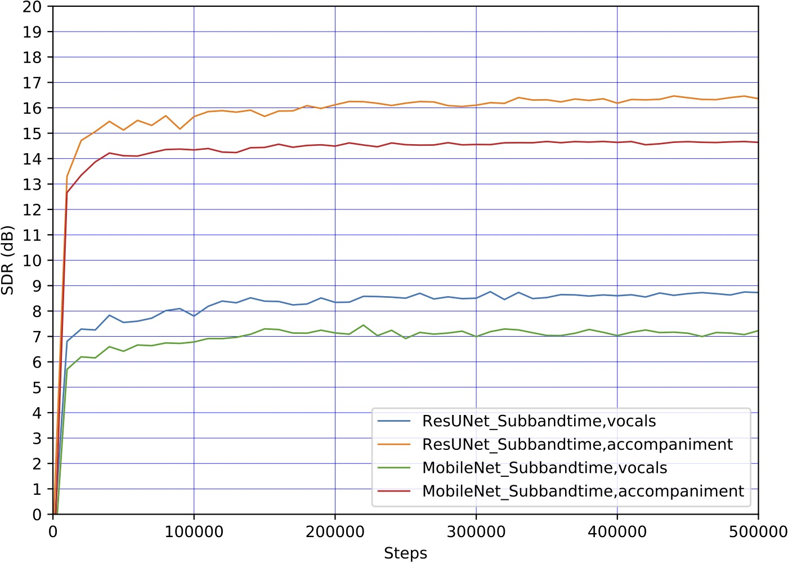

# Music Source Separation

Music source separation is a task to separate audio recordings into individual sources. This repository is an PyTorch implmementation of music source separation. Users can separate their favorite songs into different sources by installing this repository. Users can also train their own source separation systems. This repository can also be used for training speech enhancement, instruments separation, and any separation systems.

## Demos

Vocals and accompaniment separation: https://www.youtube.com/watch?v=WH4m5HYzHsg

## Installation

Install Python 3.7. 

Sometimes the installation of bytesep will fail when using higher versions of Python. Suggest to use conda (or other environment manage tools) to manage the packages.

```bash
pip install bytesep==0.1.1
```

## Separation
After installation, to separate your favorite song is easy. Users can execute the following commands in any directory.

```bash
python3 -m bytesep download_checkpoints
```

```bash
python3 -m bytesep separate \
    --source_type="vocals" \
    --audio_path="./resources/vocals_accompaniment_10s.mp3" \
    --output_path="separated_results/output.mp3"
```

Users can also put many audio files into a directory and separate them all.

```bash
python3 -m bytesep separate \
    --source_type="vocals" \
    --audio_path="audios_directory" \
    --output_path="outputs_directory"
```

The currently supported source types include "vocals" and "accompaniment". Users could also plug this MSS system into their own programmes. See [example.py](./example.py) for examples.

The separation models are trained ONLY on the [Musdb18 dataset](https://sigsep.github.io/datasets/musdb.html) (100 songs). Trained checkpoints can be downloaded at: [https://zenodo.org/record/5804160](https://zenodo.org/record/5804160).

## Train a music source separation system from scratch

### 0. Download dataset

Users could train on the MUSDB18 dataset to reproduce our music source separation systems. Execute the following script to download and unzip the MUSDB18 dataset:

```bash
./scripts/0_download_datasets/musdb18.sh
```

The dataset looks like:
<pre>
./datasets/musdb18
├── train (100 files)
│   ├── 'A Classic Education - NightOwl.stem.mp4'
│   └── ...
├── test (50 files)
│   ├── 'Al James - Schoolboy Facination.stem.mp4'
│   └── ...
└── README.md
</pre>

### 1. Pack audio files into hdf5 files

Pack audio waveforms into hdf5 files to speed up training.
```bash
./scripts/1_pack_audios_to_hdf5s/musdb18/sr=44100,chn=2.sh
```

### 2. Create indexes for training
```bash
./scripts/2_create_indexes/musdb18/create_indexes.sh
```

### 3. Create evaluation audios
```bash
./scripts/3_create_evaluation_audios/musdb18/create_evaluation_audios.sh
```

### 4. Train & evaluate & save checkpoints
```bash
./scripts/4_train/musdb18/train.sh
```

### 5. Separate using user trained checkpoint
```bash
./scripts/5_separate/musdb18/separate.sh
```

## Results

### 1. Separation Metrics

The following table shows the signal to noise ratio (SDR) metrics of vocals and accompaniment. The MSS systems are only trained with 100 songs from the MUSDB18 dataset. The metrics are calculated on the 50 test songs. It is highly suggest to use the subband version because it is faster to train and inference.

| Model                     | vocals (dB) | accompaniment (dB) |
|---------------------------|-------------|--------------------|
| ResUNet143 vocals         | 8.9         | 16.8               |
| ResUNet143 Subband vocals | 8.7         | 16.4               |
| MobileNet Subband vocals  | 7.2         | 14.6               |

### 2. Parameters number & speed

The following table shows the number of parameters and inference time of a 1-min audio clip.

| Model              |  Trainable params. num | process 1-min time (GPU Tesla V100) | process 1-min time (CPU Core i7) |
|--------------------|------------------------|-------------------------------------|----------------------------------|
| ResUNet143 ISMIR   | 102 million            | 2.24 s                              | 53.00 s                          |
| ResUNet143 Subband | 102 million            | 0.56 s                              | 13.68 s                          |
| MobileNet Subband  | 0.306 million          | 0.33 s                              | 9.84                             |

### 3. Metrics over step

The evaluation metrics over different stesp is shown below.



## Finetune on new datasets

Users can finetuen pretrained checkpoints on new datasets. The following script is a template showing how to finetune pretrained a MSS system to the VCTK dataset for speech enhancement. (This is just an example. There is no problem if users do not have the VCTK dataset.) Users can also resume the training from a checkpoint by modifying the following script.

```bash
./scripts/4_train/vctk-musdb18/finetune.sh
```

## Cite

[1] Qiuqiang Kong, Yin Cao, Haohe Liu, Keunwoo Choi, Yuxuan Wang, Decoupling Magnitude and Phase Estimation with Deep ResUNet for Music Source Separation, International Society for Music Information Retrieval (ISMIR), 2021.
```
@inproceedings{kong2021decoupling,
  title={Decoupling Magnitude and Phase Estimation with Deep ResUNet for Music Source Separation.},
  author={Kong, Qiuqiang and Cao, Yin and Liu, Haohe and Choi, Keunwoo and Wang, Yuxuan },
  booktitle={ISMIR},
  year={2021},
  organization={Citeseer}
}
```

## Contact

Qiquiang Kong


## Frequent Asked Questions (FAQ)

[FAQ.md](FAQ.md)


## External Links

Other open sourced music source separation projects include but not limited to:

Subband ResUNet: [https://github.com/haoheliu/Subband-Music-Separation](https://github.com/haoheliu/Subband-Music-Separation)

Demucs: [https://github.com/facebookresearch/demucs](https://github.com/facebookresearch/demucs)

Spleeter: [https://github.com/deezer/spleeter](https://github.com/deezer/spleeter)

Asteroid: [https://github.com/asteroid-team/asteroid](https://github.com/asteroid-team/asteroid)

Open-Unmix: [https://github.com/sigsep/open-unmix-pytorch](https://github.com/sigsep/open-unmix-pytorch)
